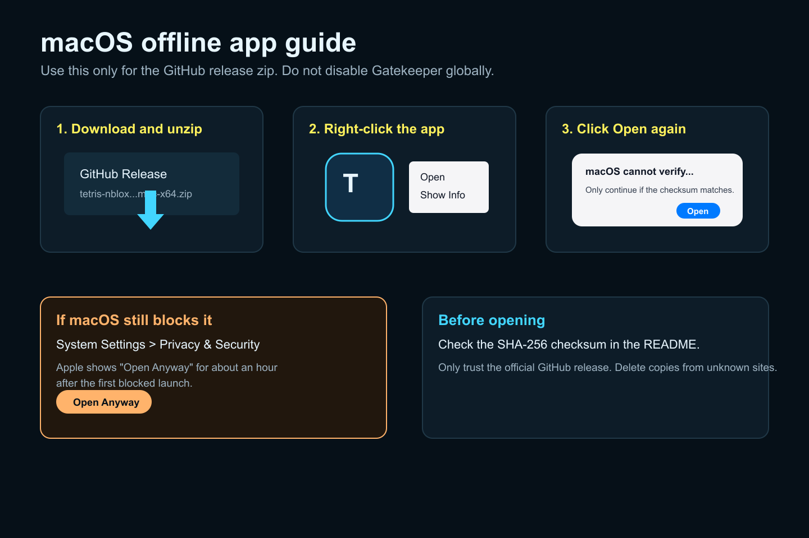
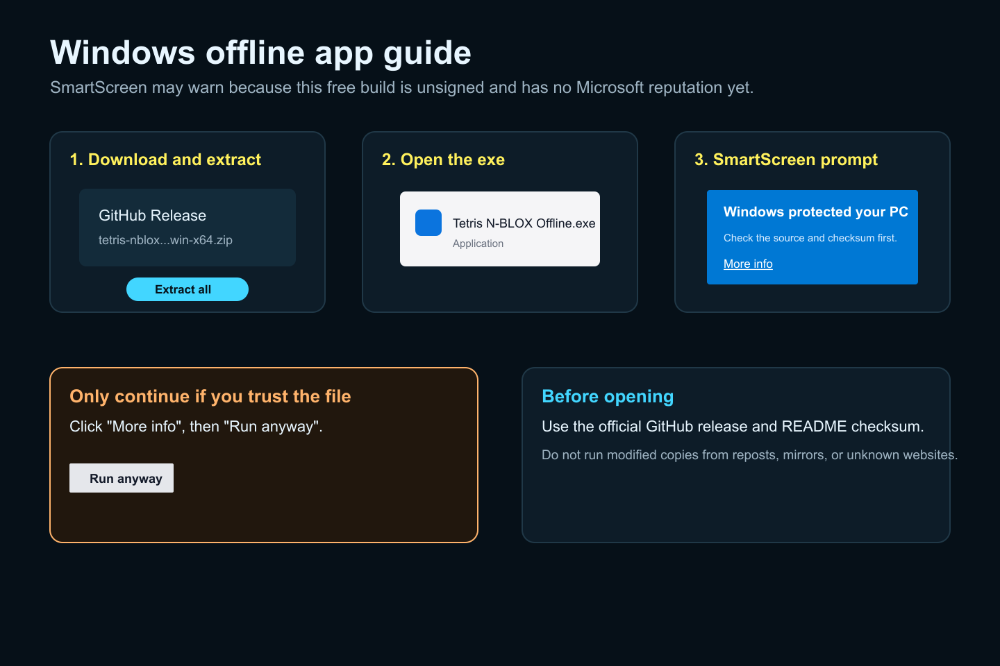

# Tetris N-BLOX Offline

Play Tetris N-BLOX from a public browser page or from an offline Electron build.

## Recommended: Play in Browser

Use the browser version first:

```text
https://svanny.github.io/n-blox-offline/
```

No install is required, so there is no macOS Gatekeeper prompt, no Windows SmartScreen prompt, and no Terminal command to paste. On macOS Sonoma 14+, Safari can save the page as an app from `File > Add to Dock`; Apple documents that feature here:

```text
https://support.apple.com/en-kw/104996
```

## Offline App

Download the release zip only from:

```text
https://github.com/Svanny/n-blox-offline/releases/tag/v1.0.0
```

Checksums:

```text
bbbb85344012bc1e7f507ae4cae0a9d456ecf28e45caa602a3704396b1d5f696  tetris-nblox-wacz-offline-1.0.0-mac-x64.zip
16e14277e4d9b62890c224fb2a189e19b3c90d9ce984bd69532a3fed21a5357d  tetris-nblox-wacz-offline-1.0.0-win-x64.zip
```

This app is not Apple-notarized. macOS is warning you because Apple has not checked this build. The developer is an independent hobbyist and cannot justify Apple's $99/year Developer Program fee for this free offline game wrapper right now.

Windows may show SmartScreen because this free build is unsigned and has no Microsoft reputation yet.

Only open files downloaded from the GitHub release above, and check the SHA-256 checksum before running them. Do not disable Gatekeeper globally. Do not run modified copies from reposts, mirrors, or unknown websites.

### macOS Offline Guide



1. Download `tetris-nblox-wacz-offline-1.0.0-mac-x64.zip` from the GitHub release.
2. Unzip it.
3. Right-click `Tetris N-BLOX Offline.app`.
4. Click `Open`.
5. Click `Open` again in the unknown-developer prompt.
6. If needed, use `System Settings > Privacy & Security > Open Anyway`.

Apple documents the unknown-developer flow here:

```text
https://support.apple.com/en-kw/guide/mac-help/open-a-mac-app-from-an-unknown-developer-mh40616/mac
```

### Windows Offline Guide



1. Download `tetris-nblox-wacz-offline-1.0.0-win-x64.zip` from the GitHub release.
2. Extract all files.
3. Open `Tetris N-BLOX Offline.exe`.
4. If SmartScreen appears, click `More info`.
5. Click `Run anyway` only if the file came from the official GitHub release and the checksum matches.

## Advanced: Build Locally From Source

Do not paste Terminal commands from the internet unless you trust the source and understand what they do. This script downloads code from GitHub, installs dependencies, builds an app, and copies it into `~/Applications`.

Building locally avoids downloading a prebuilt app, but it does not magically make the software safe. Read the script before running it:

```text
scripts/build-mac-from-source.sh
```

Run it on macOS with:

```bash
bash scripts/build-mac-from-source.sh
```

Developer notes, local packaging commands, and project layout live in [`DEVELOPMENT.md`](DEVELOPMENT.md).
